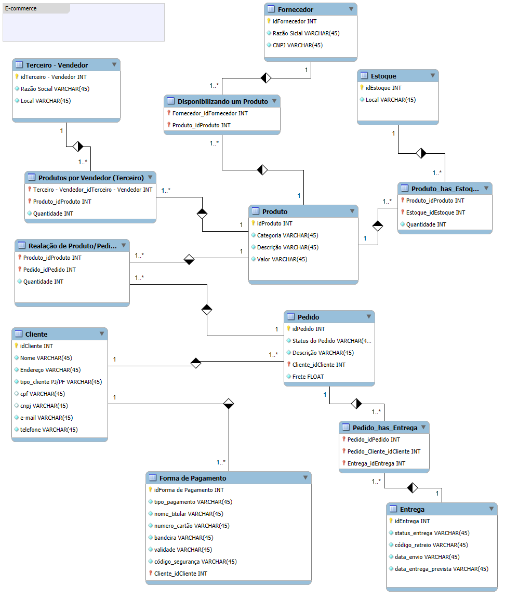

# Projeto: Modelagem de Banco de Dados para E-commerce

Este projeto visa demonstrar o processo de análise e modelagem de um banco de dados para um sistema de E-commerce, partindo do levantamento de requisitos até a criação do Diagrama Entidade-Relacionamento (DER). O trabalho foi desenvolvido como parte do curso Randstad - Análise de Dados.

## Levantamento de Requisitos e Escopo
O escopo do projeto foi definido em torno dos principais componentes de um sistema de vendas online, conforme ilustrado no diagrama inicial e detalhado pelas narrativas de requisitos.

## Principais Componentes (Entidades)

- Componente: Descrição (Baseada nos Requisitos).

- Cliente: Pessoa Física (PF) ou Pessoa Jurídica (PJ), mas não ambos. Possui cadastro (CPF/CNPJ) e endereço, que influencia o valor do frete. Pode ter múltiplas formas de pagamento cadastradas.
- Produto: Vendido por uma única plataforma, mas pode ter vendedores (terceiros) distintos. Cada produto tem um fornecedor.
- Pedido: Criado pelo cliente, contém informações de compra, endereço de entrega e status. Pode ser cancelado. É composto por um ou mais produtos.
- Estoque: Gerencia a disponibilidade dos produtos.
- Fornecedor: Entidade responsável por prover o produto.
- Entrega: Associada ao pedido, possui status e código de rastreio.

## Modelagem de Dados: Diagrama Entidade-Relacionamento (DER)

O Modelo Entidade-Relacionamento (MER) foi escolhido para representar a estrutura lógica do banco de dados, focando na identificação das entidades, seus atributos e as relações entre elas.

O diagrama foi desenvolvido utilizando o MySQL Workbench.

## Conclusão e Aprendizados
A conclusão da modelagem de dados para o projeto de E-commerce resultou em um esquema otimizado para o registro de vendas e gerenciamento de estoque e clientes.

Principais Aprendizados:

Levantamento de Requisitos: Entender como a narrativa do negócio se traduz em regras e atributos do banco de dados.

Modelagem de Cardinalidades: A importância de definir corretamente as relações 1:N e N:M para estruturar as tabelas e garantir a integridade referencial.

Uso de Ferramentas: Habilidade de utilizar o MySQL Workbench para criar e visualizar o DER, transformando conceitos teóricos em um modelo físico (esquema).

Introdução à Arquitetura: Compreensão das decisões arquiteturais envolvidas na escolha do SGBD e na aplicação de normalização para um sistema transacional.

## License

[MIT](https://choosealicense.com/licenses/mit/)